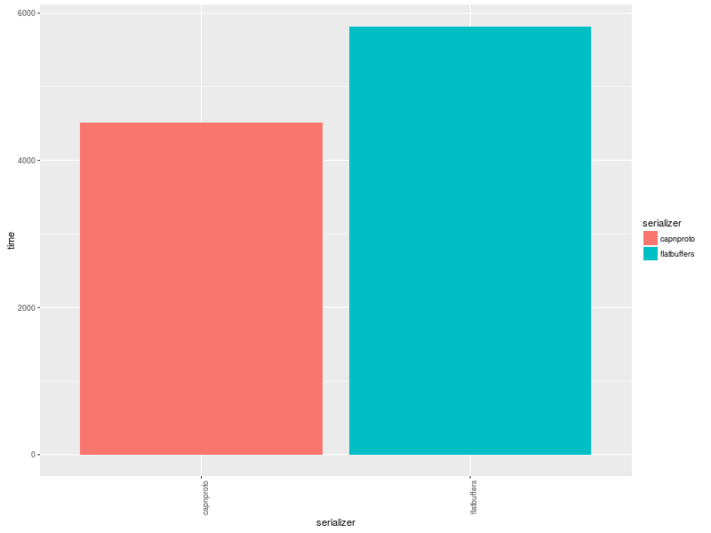

#### About

Compare various data serialization libraries for C++.

* [Thrift](http://thrift.apache.org/)
* [Protobuf](https://code.google.com/p/protobuf/)
* [Boost.Serialization](http://www.boost.org/libs/serialization)
* [Msgpack](http://msgpack.org/)
* [Cereal](http://uscilab.github.io/cereal/index.html)
* [Avro](http://avro.apache.org/)
* [Capnproto](https://capnproto.org/)
* [Flatbuffers](https://google.github.io/flatbuffers/)

#### Build
This project does not have any external library dependencies. All (boost, thrift etc.) needed libraries are downloaded
and built automatically, but you need enough free disk space to build all components. To build this project you need a compiler that supports
C++11 features. Project was tested with GCC 4.8.2 (Ubuntu 14.04).

```
$ git clone https://github.com/thekvs/cpp-serializers.git
$ mkdir /path/to/build-root/
$ cd /path/to/build-root/
$ cmake /path/to/cpp-serializers -DCMAKE_BUILD_TYPE=Release
$ make
```

#### Usage
* Test __all__ serializers, run each serializer 100000 times:
```
$ ./benchmark 100000
```
* Test only __protobuf__ serializer, run it 100000 times:
```
$ ./benchmark 100000 protobuf
```
* Test __protobuf__ and __cereal__ serializers only, run each of them 100000 times:
```
$ ./benchmark 100000 protobuf cereal
```

#### Results

Following results were obtained running 1000000 serialize-deserialize operations 50 times and then averaging results
on a typical desktop computer with Intel Core i5 processor running Ubuntu 14.04. Exact versions of libraries used are:

* thrift 0.9.2
* protobuf 2.6.0
* boost 1.59.0
* msgpack 0.5.9
* cereal 1.1.2
* avro 1.7.7
* capnproto 0.5.2
* flatbuffers 1.3.0

| serializer     | object's size | avg. total time |
| -------------- | ------------- | --------------- |
| thrift-binary  | 17017         | 13763           |
| thrift-compact | 11597         | 27017           |
| protobuf       | 12571         | 21034           |
| boost          | 17470         | 22945           |
| msgpack        | 11902         | 23560           |
| cereal         | 17416         | 10688           |
| avro           | 12288         | 31750           |

###### Size


###### Time


For capnproto and flatbuffers since they already store data in a "serialized" form and serialization basically means getting pointer
to the internal storage, we measure full __build__/serialize/deserialize cycle. In the case of other libraries we measure
serialize/deserialize cycle of the already built data structure.

| serializer     | object's size | avg. total time |
| -------------- | ------------- | --------------- |
| capnproto      | 17768         | 4396            |
| flatbuffers    | 17632         | 12494           |



Size measured in bytes, time measured in milliseconds.

