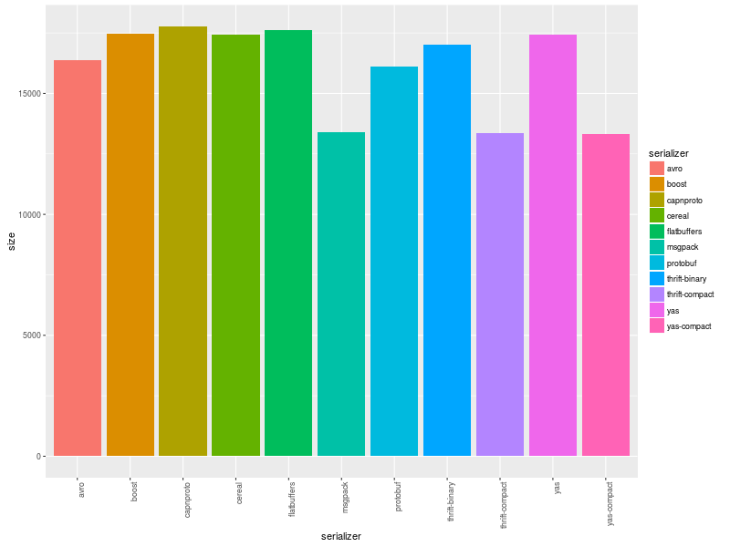

#### [Thrift](http://thrift.apache.org/) vs. [Protobuf](https://code.google.com/p/protobuf/) vs. [Boost.Serialization](http://www.boost.org/libs/serialization) vs. [Msgpack](http://msgpack.org/) vs. [Cereal](http://uscilab.github.io/cereal/index.html) serialization/deserialization time test for C++.

#### Build
This project does not have external library dependencies. All (boost, thrift etc.) needed libraries are downloaded
and built automatically, but you need enough free disk space. To build this project you need a compiler that supports
C++11 features. Project was tested with GCC 4.7 (ubuntu 13.04).

```
$ git clone https://github.com/thekvs/cpp-serializers.git
$ mkdir /path/to/build-root/
$ cd /path/to/build-root/
$ cmake /path/to/cpp-serializers -DCMAKE_BUILD_TYPE=Release
$ make
```

#### Usage
1. Test all serializers, run each serializer 100000 times:
```
$ ./test 100000
```
1. Test only protobuf serializer, run it 100000 times:
```
$ ./test 100000 protobuf
```
1. Test protobuf and cereal serializers only, run each of them 100000 times:
```
$ ./test 100000 protobuf cereal
```

#### Results


