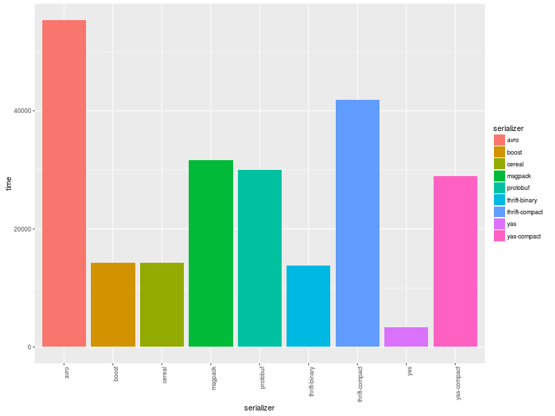

# About

Compare various data serialization libraries for C++.

* [Thrift](http://thrift.apache.org/)
* [Protobuf](https://code.google.com/p/protobuf/)
* [Boost.Serialization](http://www.boost.org/libs/serialization)
* [Msgpack](http://msgpack.org/)
* [Cereal](http://uscilab.github.io/cereal/index.html)
* [Avro](http://avro.apache.org/)
* [Capnproto](https://capnproto.org/)
* [Flatbuffers](https://google.github.io/flatbuffers/)
* [YAS](https://github.com/niXman/yas)

# Build

This project does not have any external serialization libraries dependencies. All (boost, thrift etc.) needed libraries are downloaded and built automatically, but you need enough free disk space to build all components. To build this project you need a compiler that supports C++14 features. Project was tested with Clang and GCC compilers.

1. `git clone https://github.com/thekvs/cpp-serializers.git`
1. `cd cpp-serializers`
1. `mkdir build`
1. `cd build`
1. `cmake -DCMAKE_BUILD_TYPE=Release ..`
1. `cmake --build .`

# Usage

```shell
./benchmark -h
Benchmark various C++ serializers
Usage:
  benchmark [OPTION...]

  -h, --help             show this help and exit
  -l, --list             show list of supported serializers
  -i, --iterations arg   number of serialize/deserialize iterations
  -s, --serializers arg  comma separated list of serializers to test
```

* Benchmark **all** serializers, run each serializer 100000 times:
```
$ ./benchmark -i 100000
```
* Benchmark only **protobuf** serializer, run it 100000 times:
```
$ ./benchmark -i 100000 -s protobuf
```
* Benchmark **protobuf** and **cereal** serializers only, run each of them 100000 times:
```
$ ./benchmark -i 100000 -s protobuf,cereal
```

# Results

Following results were obtained running 1000000 serialize-deserialize operations 50 times and then averaging results on a typical desktop computer with Intel Core i7 processor running Ubuntu 16.04. Exact versions of libraries used are:

* thrift 0.12.0
* protobuf 3.7.0
* boost 1.69.0
* msgpack 3.1.1
* cereal 1.2.2
* avro 1.8.2
* capnproto 0.7.0
* flatbuffers 1.10.0
* YAS 7.0.2

| serializer     | object's size | avg. total time |
| -------------- | ------------- | --------------- |
| thrift-binary  | 17017         | 1190.22         |
| thrift-compact | 13378         | 3474.32         |
| protobuf       | 16116         | 2312.78         |
| boost          | 17470         | 1195.04         |
| msgpack        | 13402         | 2560.6          |
| cereal         | 17416         | 1052.46         |
| avro           | 16384         | 4488.18         |
| yas            | 17416         | 302.7           |
| yas-compact    | 13321         | 2063.34         |


## Size


## Time



For capnproto and flatbuffers since they already store data in a "serialized" form and serialization basically means getting pointer to the internal storage, we measure full **build**/serialize/deserialize cycle. In the case of other libraries we measure serialize/deserialize cycle of the already built data structure.

| serializer     | object's size | avg. total time |
| -------------- | ------------- | --------------- |
| capnproto      | 17768         | 400.98          |
| flatbuffers    | 17632         | 491.5           |


Size measured in bytes, time measured in milliseconds.
